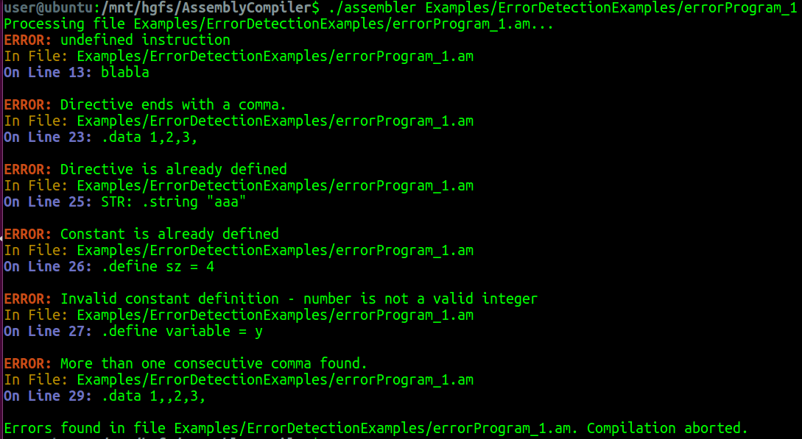

## Description
Special Assembly compiler (Assembler) - written in C.

The program analyzes the input file and generates a machine code file.
The machine code is an encoded version of the assembly code.
In addition the assembler generates two more files, an externs file and an entry file.
The externs file contains the names of the external variables and their addresses.
The entry file contains the names of the entry variables and their addresses.

## Error Handling
The assembler checks for errors in the input file and prints the error message to the screen.
The assembler stops the compilation process if an error is found.

## Usage
```bash
$ make
$ ./assembler <input_file1> <input_file2> ...
```

## Example
```bash
$ ./assembler Examples/ValidFilesExamples/validProgram1.as
```
The files look like this:
```bash
$ cat Examples/ValidFilesExamples/validProgram1.as
```

```assembly
.entry LIST
.extern W
.define sz = 2

MAIN:       mov  r3, LIST[sz]

LOOP:       jmp W
            prn #-5
            mov STR[5], STR[2]

            ; A comment
            sub r1, r4
            cmp K, #sz
            ; The next line is an empty comment

            bne W
L1: inc L3
.entry LOOP
            bne LOOP
END:        hlt
.define len = 4

STR:        .string "abcdef"
LIST:       .data 6, -9, len
K:          .data 22
.extern L3
```
This code will be compiled to the following machine code:

| Decimal | Address | Source Code                  | Binary Machine | Code |
|---------|---------|------------------------------|----------------|------|
| 0100    |         |                              |                |      |
| 0101    |         |                              |                |      |
| 0102    |         |                              |                |      |
| 0103    |         |                              |                |      |
|         |         | MAIN: mov r3, LIST[sz]       | 00000000111000 |      |
|         |         |                              |                |      |
|         |         |                              |                | 00000000001000 |
| 0104    |         |                              |                |      |
| 0105    |         |                              |                |      |
| 0106    |         |                              |                |      |
| 0107    |         |                              |                |      |
|         |         | LOOP: jmp W                  | 00001001001000 |      |
|         |         |                              |                |      |
|         |         |                              |                | 00000000000001 |
| 0108    |         |                              |                |      |
| 0109    |         |                              |                |      |
| 0110    |         |                              |                |      |
|         |         | prn #-5                      | 00001100000000 |      |
|         |         |                              |                |      |
|         |         |                              |                | 11111111101100 |
| 0111    |         |                              |                |      |
| 0112    |         |                              |                |      |
|         |         | mov STR[5], STR[2]          | 00000000101000 |      |
|         |         |                              |                |      |
|         |         |                              |                | 00000000001000 |
|         |         |                              |                | 00000111110110 |
|         |         |                              |                | 00000000010100 |
|         |         |                              |                | 00000111110110 |
|         |         |                              |                | 00000000001000 |
| 0113    |         |                              |                |      |
|         |         | sub r1, r4                  | 00000011111100 |      |
|         |         |                              |                |      |
|         |         |                              |                | 00000000110000 |
| 0115    |         |                              |                |      |
| 0116    |         |                              |                |      |
| 0117    |         |                              |                |      |
|         |         | cmp K, #sz                  | 00000001010000 |      |
|         |         |                              |                |      |
|         |         |                              |                | 00000000001000 |
|         |         |                              |                | 00001000011110 |
| 0118    |         |                              |                |      |
| 0119    |         |                              |                |      |
| 0120    |         |                              |                |      |
|         |         | bne W                        | 00001010000100 |      |
|         |         |                              |                |      |
|         |         |                              |                | 00000000000001 |
| 0121    |         |                              |                |      |
| 0122    |         |                              |                |      |
| 0123    |         |                              |                |      |
| 0124    |         |                              |                |      |
|         |         | L1: inc L3                  | 00000111000100 |      |
|         |         |                              |                |      |
|         |         |                              |                | 00000000000001 |
| 0125    |         |                              |                |      |
| 0126    |         |                              |                |      |
| 0127    |         |                              |                |      |
| 0128    |         |                              |                |      |
|         |         | END: hlt                     | 00001111000000 |      |
| 0129    |         |                              |                |      |
|         |         | STR: .string “abcdef”       | 00000001100001 |      |
|         |         |                              |                |      |
|         |         |                              |                | 00000001100010 |
|         |         |                              |                | 00000001100011 |
| 0130    |         |                        |                |      |
|         |         |                        |                |      |
|         |         |                        |                |      |
|         |         | STR: .string “abcdef” | 00000001100001 |      |
|         |         |                        |                |      |
|         |         |                        |                | 00000001100010 |
|         |         |                        |                | 00000001100011 |
| 0131    |         |                        |                |      |
|         |         |                        |                | 00000001100100 |
|         |         |                        |                | 00000001100101 |
|         |         |                        |                | 00000001100110 |
| 0132    |         |                        |                |      |
|         |         |                        |                |      |
|         |         |                        |                |      |
| LIST: .data 6, -9, len | 00000000000110 | 11111111110111 | 00000000000100 |
| 0135    |         |                        |                | 00000000010110 |


The files generated by the assembler will be in the same directory as the input file.
The encoded file will be named as the input file with the extension .ob
The externs file will be named as the input file with the extension .ext
The entry file will be named as the input file with the extension .ent
The files look like this:
```bash
$ cat Examples/ValidFilesExamples/validProgram1.ob
```

```bash

  25 11
0100 ****!%*
0101 ***#%**
0102 **%*#*%
0103 *****%*
0104 **%#*#*
0105 ******#
0106 **!****
0107 !!!!%!*
0108 ****%%*
0109 **#!!#%
0110 ****##*
0111 **#!!#%
0112 *****%*
0113 ***!!!*
0114 ****!**
0115 ***##**
0116 **%*#!%
0117 *****%*
0118 **%%*#*
0119 ******#
0120 **#!*#*
0121 ******#
0122 **%%*#*
0123 **#%%*%
0124 **!!***
0125 ***#%*#
0126 ***#%*%
0127 ***#%*!
0128 ***#%#*
0129 ***#%##
0130 ***#%#%
0131 *******
0132 *****#%
0133 !!!!!#!
0134 *****#*
0135 ****##%


```

```bash

$ cat Examples/ValidFilesExamples/validProgram1.ext
```

```bash

W 0105
W 0119
L3 0121

```

```bash

$ cat Examples/ValidFilesExamples/validProgram1.ent
```

```bash

LOOP 0104
LIST 0132


```
The assembler can also recognize errors in the input file.
Errors can look like:





